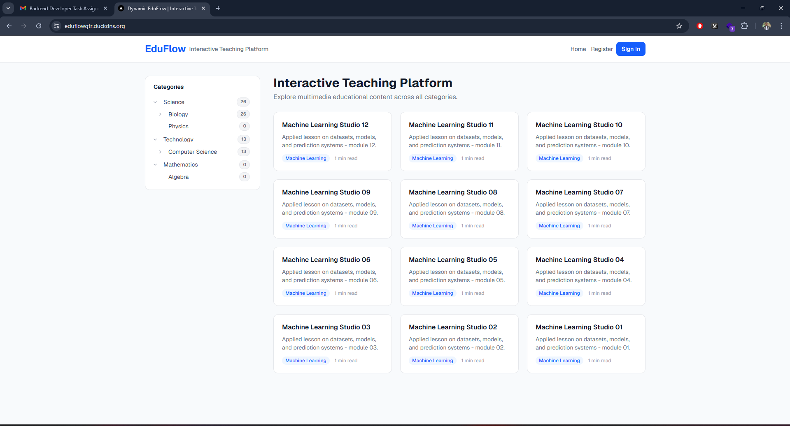
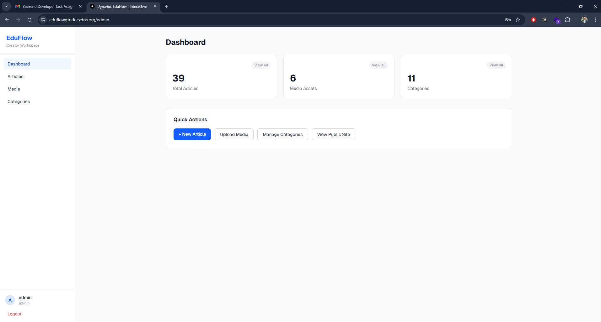
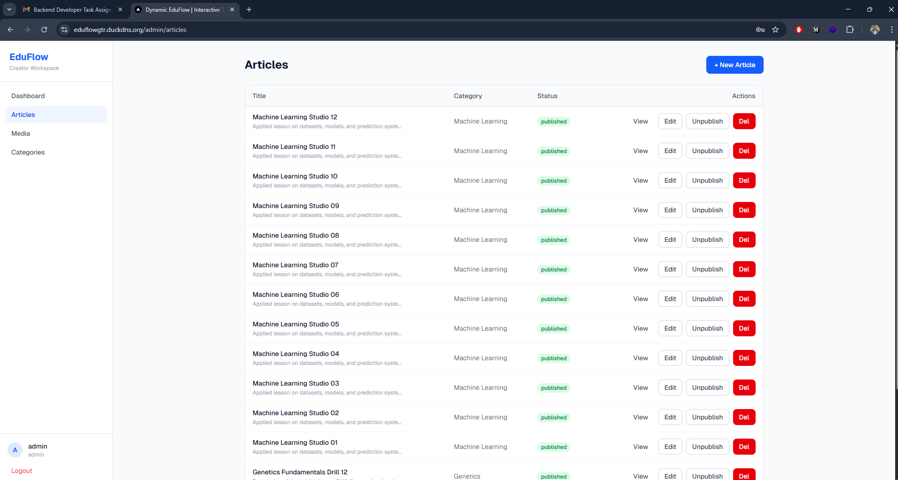
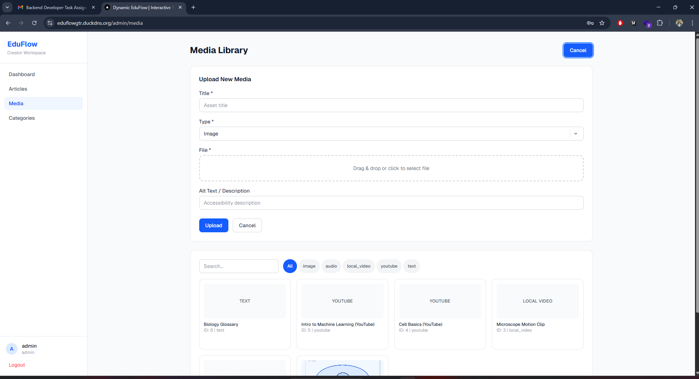
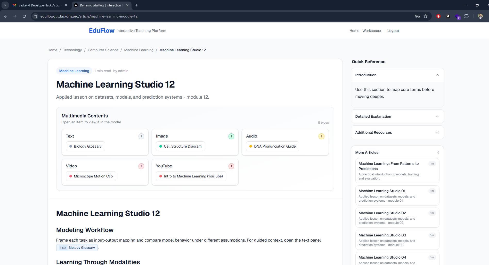
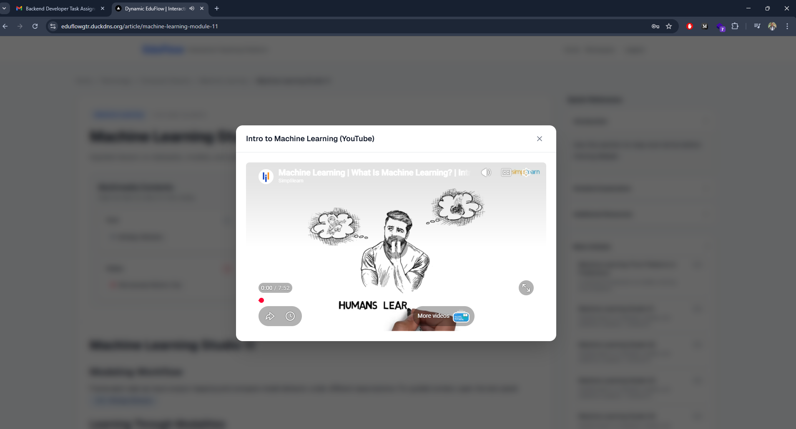

# Dynamic EduFlow

Dynamic EduFlow is a full-stack multimedia learning platform with a public article experience and an admin workspace for categories, media assets, and article authoring.

## Brief explanation of approach

The project follows a modular full-stack approach: a FastAPI backend provides clean REST APIs for authentication, categories, media, and articles, while a Next.js frontend consumes those APIs for both public learning pages and admin workflows. Docker Compose is used as the standard runtime so backend, frontend, and database run in a reproducible environment. The implementation emphasizes clear data contracts, media-first content authoring, and deployment-ready configuration for local and cloud environments.

## Tech Stack

- Frontend: Next.js (App Router), TypeScript, Tailwind CSS, React Query, TipTap, Zustand
- Backend: FastAPI, SQLAlchemy, Pydantic
- Database: PostgreSQL
- Runtime: Docker Compose

## Repository Structure

```text
.
├── platform_frontend/        # Next.js application
├── platform_backend/         # FastAPI application
├── docker-compose.yml        # Development compose
├── docker-compose.prod.yml   # Production overlay compose
└── .env.example              # Root environment template for compose
```
## SS (Screenshots)

<table>
	<tr>
		<td align="center" width="50%">
			
			<br />
			<sub><b>Home Page</b></sub>
		</td>
		<td align="center" width="50%">
			
			<br />
			<sub><b>Admin Dashboard</b></sub>
		</td>
	</tr>
	<tr>
		<td align="center" width="50%">
			
			<br />
			<sub><b>Admin Articles List</b></sub>
		</td>
		<td align="center" width="50%">
			
			<br />
			<sub><b>Media Library</b></sub>
		</td>
	</tr>
	<tr>
		<td align="center" width="50%">
			
			<br />
			<sub><b>Article Details</b></sub>
		</td>
		<td align="center" width="50%">
			
			<br />
			<sub><b>Content Model</b></sub>
		</td>
	</tr>
</table>

## Features

- Public article browsing by category
- Rich article content with media trigger rendering (`[[media:N]]`)
- Multimedia content section per article
- Category tree with aggregated article counts
- Admin workspace for:
- Category CRUD (tree)
- Media upload/library management
- Article create/edit with side panels and multimedia linking
- Authentication with access/refresh cookie flow

## Prerequisites

- Docker Desktop (or Docker Engine + Compose v2)
- Git
- Node.js 20+ (only needed for local non-Docker frontend run)
- Python 3.12+ (only needed for local non-Docker backend run)

## Environment Setup

Create root environment file:

Windows (PowerShell):

```powershell
Copy-Item .env.example .env
```

Linux/macOS:

```bash
cp .env.example .env
```

Then adjust values in `.env` as needed.

## Run With Docker (Development)

1. Build and start:

```bash
docker compose up -d --build
```

2. Check services:

```bash
docker compose ps
```

3. Open:

- Frontend: <http://localhost:3000>
- Backend API: <http://localhost:8000>
- API docs: <http://localhost:8000/docs>

4. Stop services:

```bash
docker compose down
```

## Seed Data

If `RUN_SEED=true`, seed runs during backend startup.

Manual seed run:

```bash
docker compose exec backend python seed.py
```

## Default Seed Account

- Username: `admin`
- Password: `admin123`

Change this in production workflows.

## Local Run Without Docker

### Backend

```bash
cd platform_backend
python -m venv .venv
```

Windows:

```powershell
.venv\Scripts\activate
Copy-Item .env.example .env
pip install -r requirements.txt
uvicorn app.main:app --reload --port 8000
```

Linux/macOS:

```bash
source .venv/bin/activate
cp .env.example .env
pip install -r requirements.txt
uvicorn app.main:app --reload --port 8000
```

### Frontend

```bash
cd platform_frontend
npm install
cp .env.example .env.local
npm run dev
```

## Production Deployment (Docker)

Use base + production overlay compose files:

```bash
docker compose --env-file .env -f docker-compose.yml -f docker-compose.prod.yml up -d --build
```

Health and status checks:

```bash
docker compose ps
curl http://localhost:8000/api/health
```

## AWS Notes

- Recommended starting path: EC2 + Docker Compose
- For managed database: Amazon RDS for PostgreSQL
- For media storage at scale: Amazon S3 + CDN
- Use HTTPS with ALB + ACM certificate
- Keep backend/db ports private when behind a load balancer

## CI/CD

Deployment workflow file:

- `.github/workflows/deploy.yml`

Required GitHub Secrets used by deployment:

- `DEPLOY_HOST`
- `DEPLOY_USER`
- `DEPLOY_KEY`
- `APP_DIR`


## Useful Commands

```bash
# Rebuild specific service
docker compose up -d --build backend

# Backend logs
docker compose logs -f backend

# Frontend logs
docker compose logs -f frontend

# Run frontend lint
cd platform_frontend && npm run lint
```
